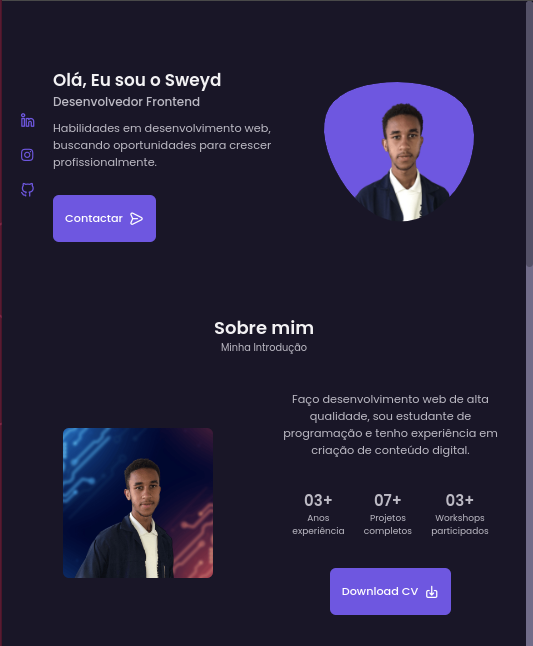

<h1 align="center"> Portfolio Website Sweyd </h1>

Site portfólio para saber mais informações sobre mim, como também meus projetos e goals.

  <a href="#-tecnologias">Tecnologias</a>&nbsp;&nbsp;&nbsp;|&nbsp;&nbsp;&nbsp;
  <a href="#-projeto">Projeto</a>&nbsp;&nbsp;&nbsp;|&nbsp;&nbsp;&nbsp;
  <a href="#-layout">Layout</a>&nbsp;&nbsp;&nbsp;|&nbsp;&nbsp;&nbsp;
  <a href="#memo-licença">Licença</a>
  

  
  
  
  
  

 

  

## 🚀 Tecnologias

Esse projeto foi desenvolvido com as seguintes tecnologias:

- HTML e CSS
- JavaScript
- [Swipper](https://swiperjs.com/)
- Git e Github

## 💻 Projeto

Site portfólio para saber mais informações sobre mim, formações, hard-skill e projetos desenvolvidos.

- Site de portfólio pessoal responsivo usando HTML, CSS e JavaScript
- Rolagem suave em cada seção.
- Inclui um modo claro e escuro.
- Desenvolvido primeiro com a metodologia Mobile First, depois para desktop.
- Compatível com todos os dispositivos móveis e com uma interface de usuário bonita e agradável.

<a href="https://sweydmanaf.github.io/portifolio">🌐 Acesse o projeto finalizado, online</a>

## 🔖 Layout

Você pode visualizar o layout do projeto através [DESSE LINK](https://youtu.be/27JtRAI3QO8).

## :memo: Licença

Esse projeto está sob a licença MIT.
